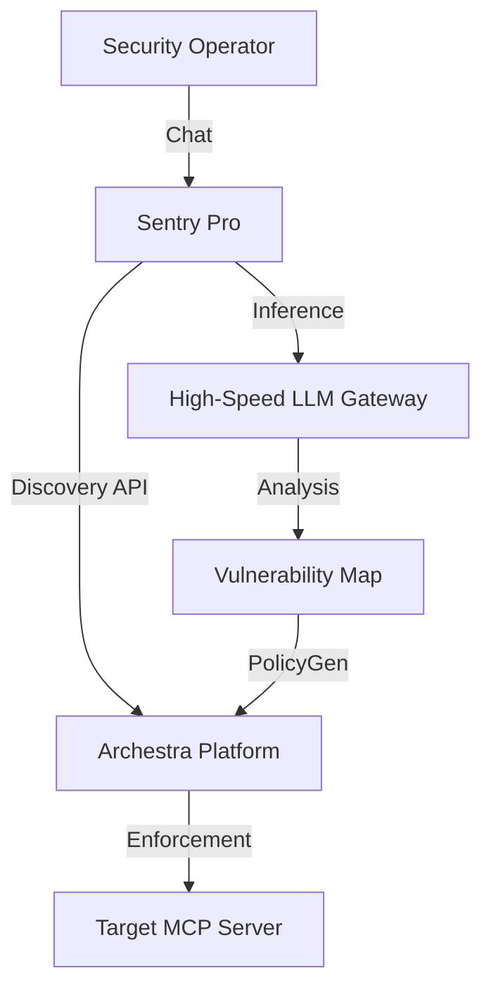

# Sentry Pro: Agentic Security Sentinel

Sentry Pro is an enterprise-grade security intelligence layer for the Model Context Protocol (MCP). It provides automated adversarial auditing, trust scoring, and real-time policy enforcement to secure the emerging ecosystem of agentic tools.

---

## The Challenge: Addressing Compositional Risk in MCP

In the transition to agentic computing, software is increasingly composed of autonomous tools that interact in unpredictable ways. This shift creates a critical security "blind spot" known as **Compositional Risk**.

### Problem Statement
Most security tools analyze software in isolation. In the MCP ecosystem, vulnerabilities often emerge not from a single tool, but from the interaction between multiple seemingly harmless tools. We have identified this as the **Systemic Exfiltration Chain**:

1.  **Ingress (Vulnerable Source)**: A tool designed to process external content (e.g., a web scraper or email reader).
2.  **Context (Data Access)**: A tool designed to read internal or sensitive information (e.g., a database connector or file reader).
3.  **Egress (Exfiltration Path)**: A tool designed to communicate externally (e.g., a notification service or API caller).

An adversarial prompt can manipulate an agent into chaining these tools to extract sensitive data. Sentry Pro is built specifically to detect, model, and block these multi-tool attack vectors.

---

## The Solution: Sentry Pro

Sentry Pro acts as a sentinel between the user and their MCP server portfolio. It implements a proactive, "closed-loop" security model that moves beyond static reporting to active prevention.

### Core Innovative Features

#### Hybrid Intelligence Engine
Sentry Pro utilizes a proprietary dual-gateway architecture to balance user experience with adversarial depth:
- **Interaction Layer**: Powered by high-parameter models for intelligent and intuitive operator communication.
- **Auditing Layer**: Directly integrated with high-speed inference gateways (Groq) to perform deep-packet security analysis of tool schemas and simulations in sub-second timeframes.

#### Automated TrustOps
Sentry Pro automates the entire security lifecycle for MCP servers:
- **Adversarial Discovery**: Proactive hunting for 7 categories of vulnerabilities (PII leakage, Prompt Injection, Shell Execution, etc.).
- **Dynamic Scoring**: Calculation of a weighted 100-point Trust Score for every installed server.
- **Remediation-as-Code**: Automatic generation and application of platform-level security policies to harden servers instantly.

---

## Installation and Setup

Sentry Pro is designed for seamless deployment within the Archestra ecosystem.

### Prerequisites
- Node.js 24.x or higher
- Archestra Platform (Desktop or Containerized)
- Valid API keys for high-speed inference (Groq)

### 1. Environment Configuration
Create a `.env` file in the project root:
```bash
GROQ_API_KEY=your_key_here
LLM_MODEL=llama-3.3-70b-versatile
ARCHESTRA_API_URL=http://localhost:9000
```

### 2. Build Procedure
```bash
# Clone the repository
git clone https://github.com/gilfoyleab/Sentry.git
cd Sentry

# Install dependencies and compile TypeScript
npm install
npm run build
```

### 3. Deployment via Infrastructure-as-Code
Sentry Pro is deployed using Terraform to ensure consistent configuration across environments.
```bash
# Set authentication variables
export ARCHESTRA_API_KEY="your_archestra_key"

# Initialize and apply infrastructure
cd terraform
terraform init
terraform apply -auto-approve \
  -var="archestra_api_key=$ARCHESTRA_API_KEY" \
  -var="groq_api_key=$GROQ_API_KEY"
```

---

## Deployment Logic and Architecture

Sentry Pro utilizes a host-native deployment strategy to eliminate networking bottlenecks and ensure reliable tool execution.



---

## License

This project is licensed under the **MIT License**.

Copyright (c) 2026 Aryan Kumar. Full license text is available in the [LICENSE](LICENSE) file.

---

**Built for the 2 Fast 2 MCP Hackathon**
Advancing Security Standards for the [Archestra Protocol](https://archestra.ai)
